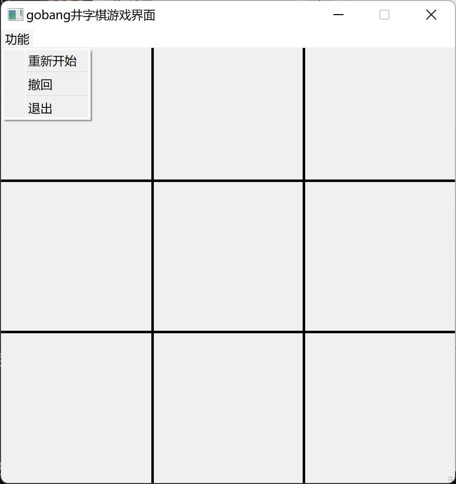
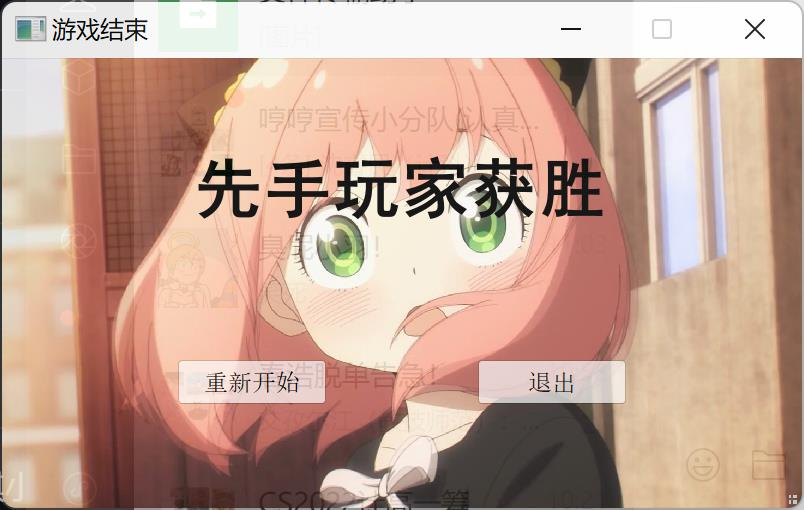

# gobang
a small game code in Cpp and Qt

## 项目介绍

准大一新生学C++和Qt框架时突发奇想写的一个井字棋小游戏，没有什么技术含量，希望大家喜欢

**界面内容**
1. 主界面（起始界面）：开始游戏和退出控件
2. 游戏界面：游戏功能、重新开始、撤回、退出控件
3. 结束界面：重新开始和退出控件

后续可能会增加人机对战的界面（模式），但也可能不会（不一定，老鸽王

---

update:2022-9-20

宣布：鸽了

---

update:2022-9-29

更新几张界面图：

1. 起始界面

   

2. 游戏界面

   

3. 结束界面之一

   
